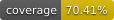

# QueueCare — Local Setup Guide

## Prerequisites

Make sure you have the following installed before getting started:

- [Node.js](https://nodejs.org/) (v16 or higher recommended)
- [npm](https://www.npmjs.com/) (comes with Node.js)
- [Git](https://git-scm.com/)

---

## Getting Started

### 1. Clone the Repository

```bash
git clone https://github.com/Rizen-Software-Design-Project/QueueCare.git
```

### 2. Navigate to the Project Root

```bash
cd QueueCare
```

### 3. Install Dependencies

```bash
npm install
```

### 4. Get the `.env` File

The app requires environment variables that are not committed to the repository for security reasons, as it contains sensitive API keys and credentials.

Contact the project leader to receive the `.env` file:

| Method | Contact |
|--------|---------|
| WhatsApp | [0661621064](https://wa.me/27661621064) |
| Email | [2826048@students.wits.ac.za](mailto:2826048@students.wits.ac.za) |

Once you have the `.env` file, place it in the **project root** (`QueueCare/`):

```
QueueCare/
├── .env          ← place it here
├── server.js
├── package.json
└── ...
```

### 5. Configure `server.js` for Local Development

Open `server.js` in the project root. It contains two configurations — Azure (production) and localhost (development).

By default, the **localhost version is active**. If it isn't, make sure `server.js` looks like this:

```js
// Azure version — keep this commented out for local dev
/*
import env from 'dotenv';
env.config();

import app from './src/appointment-booking/servers/app.js';

const port = process.env.PORT || 3000;

app.listen(port, () => {
    console.log(`${new Date().toLocaleDateString()} Server is running on port ${port}`);
});
*/

// ✅ Localhost version — this should be active (uncommented)
import 'dotenv/config'; // ← must be first, loads .env synchronously

import app from './src/appointment-booking/servers/app.js';

const port = process.env.PORT || 3000;

app.listen(port, () => {
  console.log(`${new Date().toLocaleDateString()} Server is running on port ${port}`);
});
```

> **Note:** Remember to revert any changes to `server.js` before pushing or deploying — the Azure version should be active in production.

### 6. Start the Development Server

```bash
npm run dev
```

The app should now be running locally. Open your browser and navigate to the URL shown in your terminal (typically `http://localhost:3000`).

---

## Troubleshooting

| Issue | Solution |
|-------|----------|
| `npm install` fails | Make sure your Node.js version is compatible. Try `node -v` to check. |
| App won't start | Confirm the `.env` file is in the project root and contains all required variables. |
| Environment variable errors | Double-check that you're using the localhost config in `server.js`, not the Azure one. |

---

## Contributing

Please make sure to **not commit** the `.env` file or any changes to `server.js` that switch it to localhost mode before submitting a pull request.

---


# Tests



